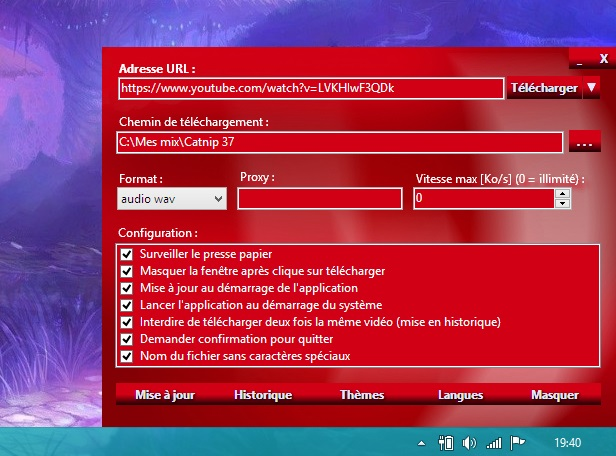
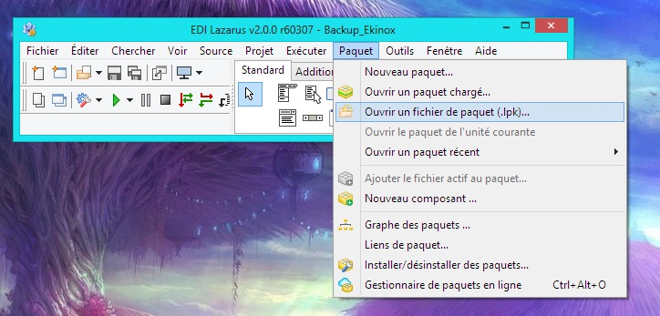
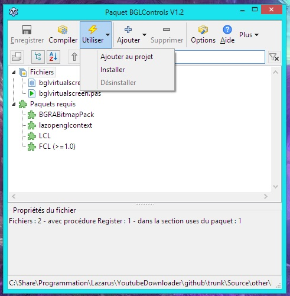
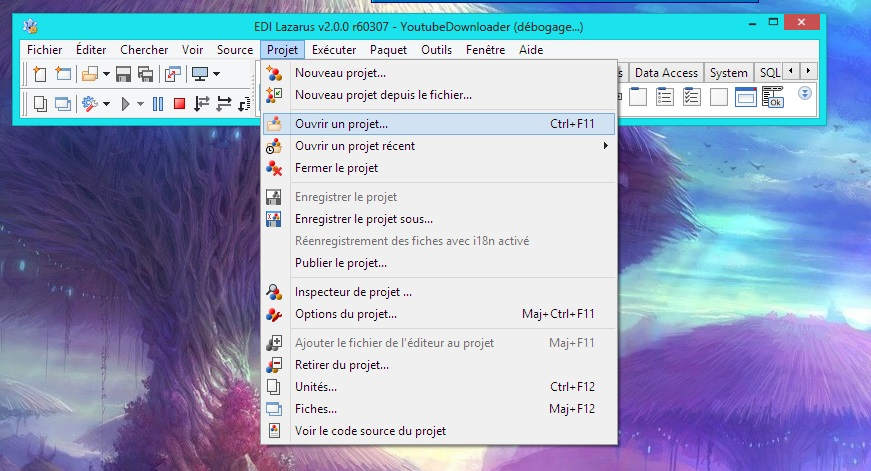
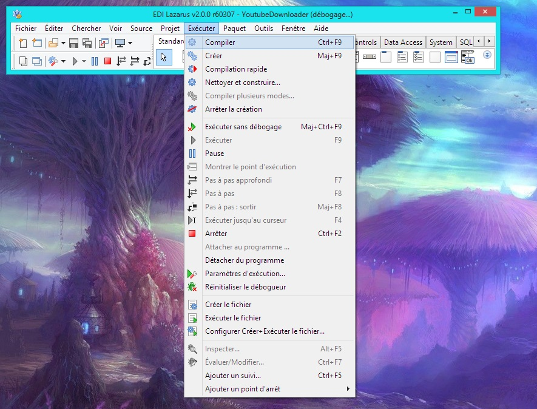

# Youtube Downloader

### Description (english):
 A video downloader for Youtube, Dailymotion and others.
 
 Can download all videos in Youtube playlist. And more.
 
 For more informations: https://github.com/rg3/youtube-dl/

 
### Description (français):

 Un programme de téléchargement de vidéos Youtube, Dailymotion et autres.
 
 Est capable de télécharger toutes les vidéos d'une playliste Youtube. Et plus encore.
 
 Pour plus d'informations: https://github.com/rg3/youtube-dl/

### Download / Télécharger:
 https://github.com/ddeeproton/YoutubeDownloader/raw/master/Setup%20installation/YoutubeDownloaderSetup_1.0.17.exe
 
### Websites compatible:
 
 https://github.com/rg3/youtube-dl/blob/master/docs/supportedsites.md
 
### Langages:
  English
  
  Français
  
  Can be translated with a XML file. Check "lang_en.xml" for eg.
  
  Peut-être traduit depuis un fichier XML. Voir "lang_en.xml" pour l'exemple.
  
  https://raw.githubusercontent.com/ddeeproton/YoutubeDownloader/master/Source/GUI/lang_en.xml

### How does it work? / Fonctionnement:
 This application will check your clipboard. If a http link is copied, then it will ask if you want to download the video, the audio or just a file. 

 Ce programme, une fois lancé, surveille votre presse papier. Dès qu'un lien http est copié, le programme vous propose de télécharger l'audio, la vidéo ou le fichier brut.

### Compilation:
 GUI is compiled with Lazarus (Free Pascal)
 
 Le GUI est compilé avec Lazarus (Free Pascal)
 
 http://www.lazarus-ide.org/
 
 ### Packets required for Lazarus / Paquets requis pour Lazarus
 
 Download and install this 2 packets below in Lazarus.
 
 Télécharger et installer ces 2 paquets ci-dessous dans Lazarus.
  
 -1. Download / Télécharger "BGRABitmap" (must be installed first / dois être installé en premier)
 
 https://github.com/bgrabitmap/bgrabitmap
  
 (Open, compile and install "bglcontrols.lpk")

 (Ouvrir, compiler et installer "bglcontrols.lpk")
  
 -2. Download / Télécharger "BGRAControls" 
 
 http://wiki.lazarus.freepascal.org/BGRAControls
 
 (Open, compile and install "bgracontrols.lpk")

 (Ouvrir, compiler et installer "bgracontrols.lpk")
 
  
  
  "Compile" and "Use / Install". Finally, click "ok" and "yes".
 
 "Compiler" puis "Utiliser / Installer". Pour finir, clique "ok" et "oui".
  
  
 
 -3. Open and Compile "YoutubeDownloader" / Ouvrir et Compiler "YoutubeDownloader" 
 
  
  
  
 
 ### If broken links / Si les liens ne fonctionnent plus
 
 For both packets, a copy is aviable in "other" folder. 
 
 Pour ces deux paquets, une copie est disponible dans le dossier "other".

https://github.com/ddeeproton/YoutubeDownloader/tree/master/Source/other
 

 
 ### How to create setup installation? / Comment créer le setup d'installation?
 
 The Setup is compiled with NSIS (Windows only)
 
 Le Setup est compilé avec NSIS (seulement sur Windows)
 
 #### Step 1 / Etape 1
 Download and Install NSIS 
 
 Télécharger et installer NSIS
 
 http://nsis.sourceforge.net/Main_Page

 #### Step 2 / Etape 2
 Set version in "Unit1.pas". Compile "YoutubeDownloader.exe" with Lazarus and copy this file in "SetupSource" folder
 
 Définir la version dans "Unit1.pas". Compiler "YoutubeDownloader.exe" avec Lazarus et copier ce fichier dans le dossier "SetupSource" 

 #### Step 3 / Etape 3
 Set version in "version.txt" (in "SetupSource" folder)
 
 Définir la version dans "version.txt" (dans le dossier "SetupSource")

 #### Step 4 / Etape 4
 Double click on "Compile Setup.bat" and wait 5 minutes
 
 Double cliquer sur "Compile Setup.bat" et attendre 5 minutes

### Operating system / Système d'exploitation:
 Windows
 
 To compile with Linux or Mac, the code must be modified before (path in "/" instead of "\\", ...)
 
 Pour compiler sur Linux ou Mac, le code devra d'abord être adapté (chemin en "/" à la place de "\\", etc.)
 

### Changes / Changements:

#### 1.0.0
Stable version

#### 1.0.17
Youtube-dl.exe - Add last version in setup installation

#### 1.0.18
Fix issue version in "YoutubeDownloader.exe"

#### 1.0.19
Fix issue with toggle button

Add download path in small view

#### 1.0.20
Fix issue in browse folder button
