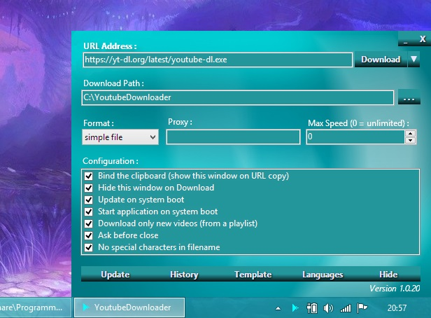

# Youtube Downloader

### Description:
 Ce programme télécharge l'audio des vidéos de Youtube, Dailymotion et autres.

### Liste des sites supportés:
 
 https://github.com/rg3/youtube-dl/blob/master/docs/supportedsites.md

### Fonctionnement:
 Ce programme, une fois lancé, surveille votre presse papier. 
 Dès qu'un lien http est copié, le programme vous propose de télécharger l'audio, la vidéo ou le fichier brut.

### Autre Documentation:	
  https://github.com/rg3/youtube-dl/blob/master/README.md

### Compilation:
 Le GUI est compilé avec Lazarus
 
 http://www.lazarus-ide.org/
 
 Composant Lazarus "BGRAControls" pour le design.
 
 http://wiki.lazarus.freepascal.org/BGRAControls
 
 Le Setup avec NSIS
 
 http://nsis.sourceforge.net/Main_Page
 
 L'application avec Python
 
 https://www.python.org/
 
 (Tous sont gratuits)

### Système d'exploitation:
 Windows
 
 Pour fonctionner sur Linux ou Mac, le code devra d'abord être adapté (chemin en "/" à la place de "\\", etc.)

### Changements:

#### 0.0.8
Ne demande plus à l'utilisateur d'écrire le titre de la vidéo. Il demande seulement le dossier de destination.

#### 0.0.9
Permet de choisir la méthode de compression

#### 0.0.10
Ne pas télécharger une seconde fois la même vidéo (valeur stoquée dans "archive.txt")

#### 0.0.11
Ajour d'un gestionnaire de cache dans le menu du systray.

#### 0.0.12
Ignore les erreurs lors d'un téléchargement de playlist.

#### 0.0.13
Ajout de l'encodage ogg.

Choix du débit.

Ajout d'un système de mise à jour.

#### 0.0.14
Vérifie Mise à jour au démarrage.

#### 0.0.15
Compatible avec mixcloud

#### 0.0.16
Affiche plus de détails lors du téléchargement

#### 0.0.17
Bug fix: Ne posait pas la question pour télécharger.

#### 0.0.18
Arrange les fenêtres sur le bas de l'écran.

#### 0.0.19
Bug fix: Arrange les fenêtres sur le bas de l'écran.

#### 0.0.20
Ajout option Démarrage avec Windows"

Ajout option "vérifier mise à jour au démarrage"

#### 0.0.21
Bug fix: "vérifier mise à jour au démarrage

Mémoriser le chemin du dossier de téléchargement et ne plus le demander

Setup: Fermeture automatique lors d'un update manuel

Setup: N'écrase pas les fichiers déjà existants (plus rapide)
  
#### 0.0.22
Nouveau design
 
#### 0.0.23
Téléchargement de video et de fichiers bruts maintenant possible

#### 0.0.24
Ajout du skin "White"

#### 0.0.25
Ajout option "Surveiller le presse-papier"

#### 0.0.26
Compatibilité Vista et + pour le fichier de configuration

#### 0.0.27
Ajout du skin "Black"

#### 0.0.28
Masque la zone "Chemin de téléchargement"

#### 0.0.29
Compatibilité Vista et + pour le setup d'installation

#### 0.0.30
Ajout option "Masquer la fenêtre après clique sur Télécharger"

#### 0.0.31
Nouveau design (plus de bordures)

Bouton "Enter" lance le téléchargement

Bouton "Esc" masque la fenêtre

#### 0.0.32
Déplacement de la fenêtre avec la souris

#### 0.0.33
Bug fix: Alignement de la fenêtre principale sur le bas à droite de l'écran.

#### 0.0.34
Nouveau design "BGRA"

#### 0.0.35
Bug fix: Système de mise à jour 

#### 0.0.36
Bug fix: Système de mise à jour sur Vista et +
 
#### 0.0.37
Bug fix: Démarrage avec Windows

#### 0.0.38
Nouveau panneau de configuration

#### 0.0.39
Ajout du bouton "Masquer"

#### 0.0.40
Ajout de l'anglais

#### 0.0.41
Ajout skin Rouge

